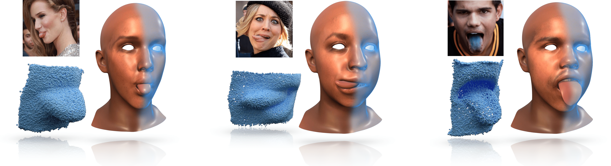
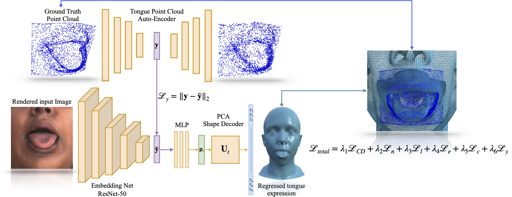
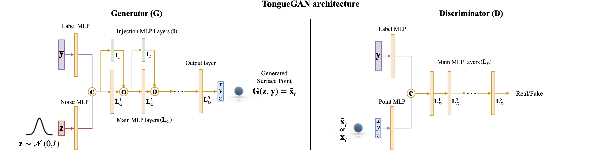
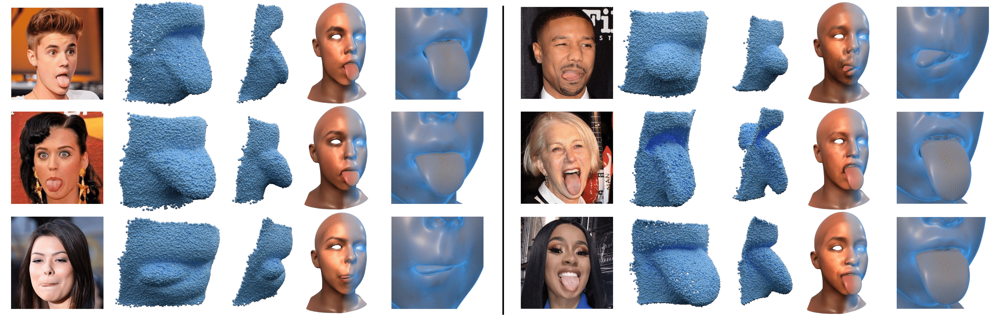

## [3D human tongue reconstruction from single ''in-the-wild'' images](https://openaccess.thecvf.com/content/CVPR2022/papers/Ploumpis_3D_Human_Tongue_Reconstruction_From_Single_In-the-Wild_Images_CVPR_2022_paper.pdf)
[](https://openaccess.thecvf.com/content/CVPR2022/papers/Ploumpis_3D_Human_Tongue_Reconstruction_From_Single_In-the-Wild_Images_CVPR_2022_paper.pdf)

[Stylianos Ploumpis](https://www.ploumpis.com)<sup> 1,2 * </sup>, [Stylianos Moschoglou](https://www.doc.ic.ac.uk/~sm3515/)<sup> 1,2 * </sup>, Vasileios Triantafyllou <sup> 2</sup>, & [Stefanos Zafeiriou](https://wp.doc.ic.ac.uk/szafeiri/)<sup> 1,2</sup>
 <br/>
 <sup>1 </sup>Imperial College London, UK
 <br/>
 <sup>2 </sup> Huawei Techologies co. ltd
 <br> 
 <sup>* </sup> Indicates equal contribution

#### [CVPR 2022]


<br/>

<p align="center"></p>

<br/>

<p align="center"></p>


## Abstract

3D face reconstruction from a single image is a task that has garnered increased interest in the Computer Vision community, especially due to its broad use in a number of applications such as realistic 3D avatar creation, pose invariant face recognition and face hallucination. Since the introduction of the 3D Morphable Model in the late 90’s, we witnessed an explosion of research aiming at particularly tackling this task. Nevertheless, despite the increasing level of detail in the 3D face reconstructions from single images mainly attributed to deep learning advances, finer and highly deformable components of the face such as the tongue are still absent from all 3D face models in the literature, although being very important for the realness of the 3D avatar representations. In this work we present the first, to the best of our knowledge, end-to-end trainable pipeline that accurately reconstructs the 3D face together with the tongue. Moreover, we make this pipeline robust in ''in-the-wild'' images by introducing a novel GAN method tailored for 3D tongue surface generation. Finally, we make publicly available to the community the first diverse tongue dataset, consisting of 1,800 raw scans of 700 individuals varying in gender, age, and ethnicity backgrounds. As we demonstrate in an extensive series of quantitative as well as qualitative experiments, our model proves to be robust and realistically captures the 3D tongue structure, even in adverse ''in-the-wild'' conditions.  

## Approach

<p align="center"></p>
An illustration of our tongue reconstruction framework. First we train the point-cloud AE on its own to get meaningful 3D features (y) of our collected point-cloud tongues. After this is done the rest of the pipeline is trained in an end-to-end fashion. We use as input to the encoder a 2D tongue image from our dataset. The encoder output is then translated through an MLP. The output of the MLP corresponds to the PCA parameters of our rigged head model. We then reconstruct the tongue expression based on the PCA model and these parameters. Finally, the tongue expression is optimised based on the ground-truth 3D tongue point-cloud (which corresponds to the input image). The optimisation is carried out by back-propagation using a number of different 

<br/>

## TongueGAN
<p align="center"></p>
TongueGAN architecture. Symbol c stands for row-wise concatenation along the channel dimension. Symbol o stands for element-wise (i.e., Hadamard) product. The Generator inputs are: i) a Gaussian noise sample z and ii) a label ~y corresponding to a particular tongue, from which we want to sample a 3D point. The Discriminator input pairs are: i) (y,x), y is a label corresponding to a specific tongue and x a real 3D point belonging to the aforementioned tongue point-cloud, ii) (~y, G(z,~y)), where ~y is a label corresponding to a tongue and G(z,~y) a generated point belonging to this tongue. The Discriminator is asked to distinguish the real from the fake (i.e., generated) pair.


<br/>

## Tongue Reconstruction Results from single images

<p align="center"></p>

<br/>

## Public release Tongue dataset
The tongue DB can now be obtained and used by researchers who wish to perform non-comercial research. Our point cloud database, contains approximately 1,800 raw 3D tongue scans. The subjects were instructed to perform a range of tongue expressions (i.e., tongue out left and right, tongue out center, tongue out center round, tongue out center extreme open mouth, tongue inside left and right, etc.). We recorded a total of 700 distinct subjects with available metadata about them, including their age, gender and race.

<p align="center"></p>

The TongueDB has been freely available for research and education purposes. To obtain access to the dataset, you need to complete and sign the user agreement form (can be found in this repository, user_agreement.pdf). This agreement should be completed by a full-time academic staff member (not a student). The form should be signed, and emailed to Stylianos Ploumpis (s.ploumpis@gmail.com), Stylianos Moschoglou (s.moschoglou@imperial.ac.uk). We will verify your request and contact you on how to download the dataset. Note that the agreement requires that:

1. The dataset must be used for non-commercial research and education purposes only.
2. You agree not copy, sell, trade, or exploit the dataset for any commercial purposes.
3. In any published research using the models, you cite the following paper:

## Citation
If you find this work is useful for your research, please cite our [paper](https://openaccess.thecvf.com/content/CVPR2022/papers/Ploumpis_3D_Human_Tongue_Reconstruction_From_Single_In-the-Wild_Images_CVPR_2022_paper.pdf):

```
@inproceedings{ploumpis20223d,
  title={3D human tongue reconstruction from single" in-the-wild" images},
  author={Ploumpis, Stylianos and Moschoglou, Stylianos and Triantafyllou, Vasileios and Zafeiriou, Stefanos},
  booktitle={Proceedings of the IEEE/CVF Conference on Computer Vision and Pattern Recognition},
  pages={2771--2780},
  year={2022}
}
```

<br/>

<br/>

## Code

TBA


